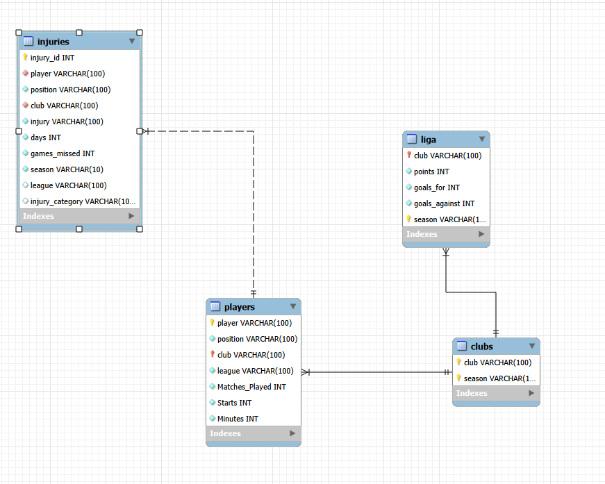

⚽ Análisis del fútbol europeo: rendimiento, jugadores y lesiones (2023–2025)
1. Introducción

El fútbol es un deporte en el que el rendimiento depende de múltiples factores, como los resultados de los equipos, la participación de los jugadores, los minutos disputados y las lesiones. Sin embargo, las estadísticas no siempre permiten explicar todo lo que sucede en el terreno de juego.

Este proyecto analiza la relación entre el rendimiento de los equipos, la participación de los jugadores y las lesiones en las cinco grandes ligas europeas durante las temporadas 2023-24 y 2024-25.

El objetivo principal es recopilar, limpiar, combinar y analizar datos futbolísticos mediante Python, Pandas, técnicas de extracción de datos web y SQL, con el fin de identificar patrones, comparar temporadas y obtener conclusiones relevantes.

El proyecto se ha desarrollado como parte del Módulo 1 del Bootcamp de Data Analytics de Ironhack, aplicando los conocimientos adquiridos sobre programación, limpieza de datos, integración de fuentes y análisis exploratorio.

2. Objetivos del proyecto

Los principales objetivos son:

Recopilar datos futbolísticos de diferentes fuentes.
Comparar el rendimiento de los equipos entre dos temporadas consecutivas.
Investigar la relación entre las posiciones de los jugadores, los minutos disputados y las lesiones.
Analizar las lesiones registradas, los días de baja y los partidos perdidos.
Construir una base de datos relacional mediante SQL.
Crear visualizaciones que permitan interpretar los principales resultados.
Identificar tendencias y limitaciones en los datos disponibles.
3. Preguntas de investigación

El análisis se estructura a partir de las siguientes preguntas:

¿Cómo ha evolucionado el rendimiento de los equipos entre las temporadas 2023-24 y 2024-25?
¿Qué equipos han obtenido mejores resultados en cada liga y temporada?
¿Cómo han variado las lesiones registradas entre ambas temporadas?
¿Qué equipos acumulan más lesiones y cómo se relacionan estos datos con sus resultados deportivos?
¿Qué posiciones acumulan más minutos de juego?
¿Existe una relación entre los minutos disputados, las lesiones y los partidos perdidos?
¿Hasta qué punto permiten las estadísticas comprender el rendimiento de un equipo y qué aspectos del fútbol siguen siendo impredecibles?

Estas preguntas sirven como guía para la recopilación de datos, las consultas SQL, el análisis exploratorio y la presentación final.

4. Fuentes de datos

El proyecto combina diferentes fuentes de información mediante archivos CSV y extracción automatizada de datos de páginas web.

Fuente 1. Clasificaciones de las ligas europeas
Página web: Sport-Histoire — Campeonatos de fútbol
Método de recopilación: extracción de datos web mediante Python, Requests y BeautifulSoup.
Cobertura: cinco grandes ligas europeas durante dos temporadas.
Competiciones: Premier League, La Liga, Bundesliga, Serie A y Ligue 1.
Temporadas: 2023-24 y 2024-25.

Las variables recopiladas incluyen:

Liga y temporada.
Nombre del equipo.
Puntos obtenidos.
Goles a favor.
Goles en contra.

Los datos se extraen de las páginas de las competiciones y se transforman en un DataFrame de Pandas para su posterior análisis.

Fuente 2. Datos de los futbolistas
Archivo: european_football_players.csv
Método de recopilación: conjunto de datos en formato CSV.
Objetivo: analizar la participación y los minutos de juego de los futbolistas.

Las principales variables utilizadas son:

Variable	Descripción
Player	Nombre del futbolista
Pos	Posición de juego
Squad	Equipo al que pertenece
Comp	Competición
MP	Partidos disputados
Starts	Partidos como titular
Min	Minutos jugados

Este conjunto de datos proporciona información individual para estudiar la participación de los jugadores y su distribución del tiempo de juego.

Fuente original: añadir el enlace de descarga o la página del proveedor del archivo CSV.

Fuente 3. Datos de lesiones
Archivo: injuries24_25.csv
Método de recopilación: conjunto de datos en formato CSV.
Temporada utilizada en la preparación actual: 2024-25.
Objetivo: analizar las lesiones registradas, las ausencias y su posible impacto en los futbolistas y sus equipos.

Las principales variables utilizadas son:

Variable	Descripción
Season	Temporada del registro
Injury	Descripción de la lesión o ausencia
Days	Días de baja
Games missed	Partidos perdidos
player_name	Nombre del futbolista
player_position	Posición del jugador
club	Equipo
league	Liga

Los registros se agrupan por jugador y equipo para calcular el total de días de baja y partidos perdidos.

Fuente original: añadir el enlace de descarga o la página del proveedor del archivo CSV.

Recopilación responsable de datos

Antes de ejecutar el proceso de extracción web, es necesario revisar las condiciones de uso de la página, las restricciones de acceso y el archivo robots.txt, evitando realizar solicitudes excesivas.

Los conjuntos de datos descargados también deben utilizarse respetando sus licencias y condiciones originales.

5. Metodología

El proyecto sigue un proceso estructurado desde la recopilación de los datos hasta su análisis.

Fase 1. Recopilación de datos

Se utilizan funciones de Python para obtener y procesar las clasificaciones de las ligas.

Las principales funciones son:

obtener_soup(url): realiza una petición a la página web y analiza su contenido HTML.
extraer_standings(soup): localiza y extrae los datos de clasificación.
convertir_standings(liga, standings): transforma los datos extraídos en registros estructurados.
crear_dataframe_ligas(ligas): procesa las direcciones de las competiciones y crea un DataFrame de Pandas.

Los conjuntos de datos de jugadores y lesiones se cargan utilizando Pandas.

Fase 2. Limpieza y transformación de datos

Los conjuntos de datos se inspeccionan y preparan antes de realizar el análisis.

Las principales técnicas de limpieza utilizadas son:

Selección de columnas: conservar únicamente las variables relevantes para las preguntas de investigación.
Filtrado por temporada: seleccionar los registros correspondientes a la temporada analizada.
Normalización de nombres: unificar los nombres de clubes y competiciones entre las diferentes fuentes.
Conversión de tipos de datos: transformar la duración de las lesiones en valores numéricos.
Agrupación de registros: sumar los días de baja y partidos perdidos por jugador y equipo.
Tratamiento de valores ausentes: sustituir por cero los valores de lesiones que no encuentran una coincidencia, teniendo en cuenta las limitaciones de esta interpretación.
Control de calidad: comprobar valores nulos, filas duplicadas y tipos de datos.

La normalización de nombres es especialmente importante, ya que distintas fuentes pueden utilizar abreviaturas o grafías diferentes para referirse al mismo club o competición.

Fase 3. Integración de los datos

Se utiliza Pandas para combinar la información de los futbolistas con los registros de lesiones agrupados.

La combinación se realiza mediante las siguientes correspondencias:

Player con player_name.
Squad con club.

Se utiliza una unión por la izquierda (left merge) para conservar todos los futbolistas del conjunto de datos principal, incluidos aquellos que no tienen una lesión coincidente en la fuente utilizada.

El DataFrame resultante reúne información sobre participación, equipo, competición y variables relacionadas con las lesiones.

Limitación importante: que un jugador no tenga un registro coincidente no demuestra que nunca haya sufrido una lesión. Significa únicamente que no se ha encontrado un registro en el conjunto de datos analizado.

Las clasificaciones de las ligas se mantienen inicialmente en un DataFrame independiente, a la espera de definir correctamente su relación con los equipos y las temporadas.

Fase 4. Modelado de la base de datos en SQL

La información preparada se organiza en tablas relacionales para facilitar consultas y análisis posteriores.

El modelo de datos contempla las siguientes tablas:

players
clubs
liga
injuries

Se utilizan claves primarias y claves foráneas para establecer relaciones entre las tablas y mantener la integridad de los datos.

A través de SQL se realizan consultas para filtrar, agrupar, agregar y comparar información de jugadores, equipos, competiciones y temporadas.

Fase 5. Análisis exploratorio de datos (EDA)

El análisis combina estadísticas descriptivas, agrupaciones y visualizaciones.

Los principales ámbitos de estudio son:

Comparación de puntos y goles de los equipos entre temporadas.
Número de lesiones por equipo y competición.
Evolución de las lesiones entre 2023-24 y 2024-25.
Comparación de la contribución de cada equipo al total de lesiones de una temporada.
Minutos jugados según la posición de los futbolistas.
Relación entre días de baja y partidos perdidos.

Los gráficos facilitan la identificación de diferencias y tendencias entre equipos y temporadas.

6. Principales resultados e interpretaciones

Los resultados definitivos deben sustentarse en las consultas SQL y las visualizaciones obtenidas durante el proyecto.

Rendimiento de los equipos

La comparación de las dos temporadas permite identificar qué equipos han mejorado o empeorado sus resultados en puntos y estadísticas de goles.

Estas diferencias sirven como punto de partida para investigar posibles cambios en el rendimiento de los equipos.

Lesiones por equipo y temporada

El análisis de los registros de lesiones permite identificar diferencias en las ausencias registradas entre equipos y temporadas.

Es importante comparar tanto los valores absolutos como los relativos. Los equipos con plantillas de distinto tamaño o con una cobertura diferente de datos no siempre son comparables utilizando únicamente el número total de lesiones.

Minutos jugados según la posición

El análisis de los minutos disputados por posición permite identificar qué roles acumulan más tiempo de juego en los datos analizados.

Esta información aporta contexto para estudiar la participación de los futbolistas y explorar posibles relaciones con las lesiones.

El rendimiento deportivo va más allá de las estadísticas

El fútbol ofrece numerosas métricas para analizar el rendimiento, pero ninguna explica por sí sola todos los resultados.

Las lesiones, las decisiones tácticas, la disponibilidad de los jugadores y los acontecimientos imprevisibles también pueden influir en el resultado de una temporada.

El análisis estadístico permite identificar patrones y formular hipótesis, pero no demuestra automáticamente que un factor sea la causa de otro.

Resultados numéricos definitivos: incorporar aquí los valores verificados de los gráficos y las consultas, incluyendo los equipos con mayores variaciones de puntos, la comparación de lesiones entre temporadas y la posición con más minutos disputados.

7. Conclusiones

Este proyecto demuestra cómo se pueden recopilar, limpiar, integrar y analizar diferentes conjuntos de datos futbolísticos para investigar el rendimiento de los equipos y la disponibilidad de sus jugadores.

La combinación de Python, Pandas, extracción de datos web y SQL permite transformar datos originales en una estructura más organizada y útil para el análisis.

La comparación entre temporadas proporciona una base para identificar cambios en los resultados deportivos y en las lesiones registradas. Por su parte, los datos individuales permiten estudiar la participación de los futbolistas y los minutos disputados según su posición.

Sin embargo, las conclusiones deben considerar las limitaciones de las fuentes. Las diferencias en cobertura, los nombres inconsistentes y la ausencia de registros completos pueden afectar a las comparaciones. Asimismo, una relación estadística entre los minutos jugados y las lesiones no demuestra por sí misma una relación causal.

En definitiva, el fútbol es un deporte que puede analizarse mediante numerosas métricas y estadísticas, pero sigue teniendo un componente imprevisible. El análisis de datos ayuda a comprender tendencias, interpretar resultados y formular mejores preguntas, aunque no puede explicar todos los acontecimientos ni garantizar un resultado deportivo.

8. Limitaciones del proyecto

El análisis presenta varias limitaciones:

Las fuentes pueden diferir en cobertura, integridad y definición de las variables.
El notebook de preparación filtra los registros de lesiones de la temporada 2024-25. Para comparar ambas temporadas correctamente, es necesario disponer de datos equivalentes para las dos.
Los jugadores y clubes deben identificarse de forma coherente entre las distintas fuentes.
La ausencia de un registro de lesión no significa necesariamente que el jugador no haya sufrido ninguna.
Las comparaciones entre equipos deben tener en cuenta el tamaño de las plantillas, la competición y la temporada.
Los datos observacionales permiten identificar asociaciones, pero no demostrar por sí solos relaciones de causa y efecto.
Las clasificaciones extraídas deben contrastarse con la fuente original para verificar la competición y la temporada correspondientes.
9. Futuras líneas de investigación

Como posibles mejoras, se plantean las siguientes líneas de trabajo:

Incorporar datos equivalentes de lesiones para ambas temporadas.
Calcular tasas de lesiones en relación con el tamaño de las plantillas o los minutos disputados, cuando los datos disponibles lo permitan.
Investigar si los equipos con más días de baja también experimentan cambios en su rendimiento deportivo.
Analizar las diferencias según la categoría de lesión y la posición del jugador.
Incorporar más temporadas para distinguir tendencias recurrentes de acontecimientos puntuales.
Mejorar el modelo relacional y automatizar las comprobaciones de calidad.
Crear un panel interactivo con Power BI.
Ampliar el análisis con variables como la edad, la carga de trabajo y el calendario de partidos.

Estas mejoras permitirían profundizar en la relación entre la disponibilidad de los jugadores y el rendimiento de los equipos.

10. Tecnologías utilizadas
Python: recopilación, procesamiento y análisis de datos.
Pandas: limpieza, transformación, agrupación y combinación de datos.
Requests: realización de peticiones HTTP para la extracción web.
BeautifulSoup: análisis de HTML y extracción de información.
Jupyter Notebook: desarrollo, documentación y análisis.
SQL / MySQL: modelado relacional y consultas analíticas.
Matplotlib / Seaborn: visualización de datos, cuando se utilizan en el análisis.
Git y GitHub: control de versiones y documentación del proyecto.
11. Estructura del repositorio

El repositorio contiene el notebook principal y los archivos de apoyo del proyecto.

PROYECTO_FUTBOL/
│
├── README.md
├── Proyecto_Futbol_ordenado.ipynb
├── european_football_players.csv
├── injuries24_25.csv
├── Proyecto_Futbol_SQL
└── [presentación y otros archivos]

La estructura definitiva debe reflejar los archivos que realmente están incluidos en GitHub. No deben publicarse credenciales de bases de datos ni otros datos sensibles.

12. Cómo ejecutar el proyecto
Requisitos

Instalar Python y las bibliotecas necesarias:

pip install pandas requests beautifulsoup4 pymysql sqlalchemy jupyter matplotlib seaborn

Solo es necesario instalar las bibliotecas que se utilicen en las celdas que se vayan a ejecutar.

Pasos para ejecutar el notebook
Clonar o descargar el repositorio.
Colocar los archivos CSV en el directorio esperado.
Abrir Proyecto_Futbol_ordenado.ipynb en Jupyter Notebook o Visual Studio Code.
Comprobar que las rutas de los archivos y las direcciones web sean correctas.
Ejecutar las celdas del notebook en orden.
Para ejecutar la fase SQL, configurar la conexión a MySQL y crear la base de datos y las tablas necesarias.
Revisar las salidas y validar los resultados antes de utilizarlos en la presentación.

Nota: la extracción web requiere conexión a internet. La fase SQL necesita una base de datos correctamente configurada para ejecutar las consultas.

13. Enlaces del proyecto
Repositorio de GitHub: PROYECTO_FUTBOL
Notebook principal: Proyecto_Futbol_ordenado.ipynb
Presentación: añadir aquí el enlace a las diapositivas.
Tablero Kanban: añadir aquí el enlace a Trello o a la herramienta de gestión utilizada.
14. Agradecimientos

Este proyecto se ha desarrollado como parte del Bootcamp de Data Analytics de Ironhack, aplicando los conocimientos adquiridos durante el Módulo 1.

Se agradece a los proveedores de los conjuntos de datos y de las clasificaciones futbolísticas utilizadas. Las fuentes originales y sus condiciones de uso deben reconocerse en la versión definitiva del proyecto.

Proyecto: Análisis del fútbol europeo: rendimiento, jugadores y lesiones (2023–2025).

Autoría: añadir los nombres de los participantes.

Programa: Ironhack — Bootcamp de Data Analytics, Proyecto del Módulo.

